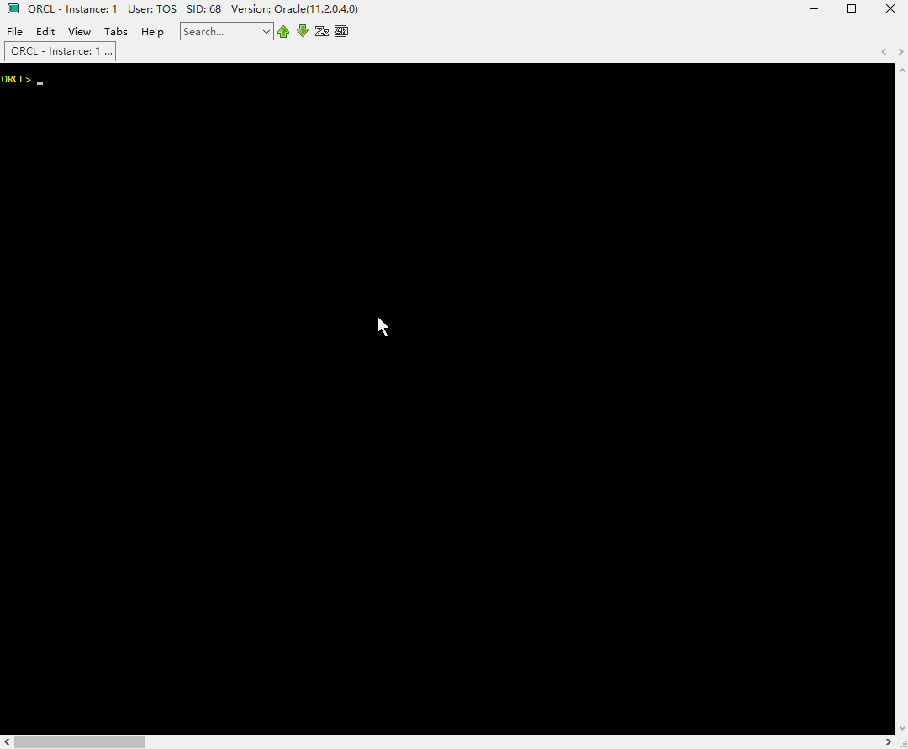

DBCLI : A CLI utility for DBA (Oracle/MySQL/DB2)
=====================================================
[](https://en.wikipedia.org/wiki/MIT_License)



Description
-----------------------

DBCLI is a portable database command line utility, for DBA or application support to easily manage and run their common used scripts, similar to database built-in CLI tools but is more flexible.  

It is mainly developed by Lua language, and bridges to JDBC to access database, many of the files are SQL scripts that easy to maintain.<br/> 
It is designed to support multiple databases, and includes 2 types of modules, one is the public module whose functions are visible across all database platforms, 
and another one is the platform-specific module.


It is not intended to support all features of the existing CLI utilities that embedded by the specific database(`Oracle SQL*Plus`, `DB2 CLP`, etc), but to provide the features other than those tools:

* Pretty-print of the select statement and the flexible control of the grid layouts(see set command)
* Automatically generate help documents for customized SQL/shell/etc scripts.
* The `alias` command to reduce the frequent inputs
* The powerful `snap` and `ora` commands as the replacement of the standard CLI scripts, so that DBA is able to quickly define and execute the SQL templates with the smallest input
* Support SSH operations
* Provides the graph charts of the database performance, refer to the "chart" command
* Easy to extend, modify or deploy, because most of the source code is not required to compile
* Easily switch to the db built-in cli utility


Download
-----------------------
DBCLI does not require compile or installation, but depends on JRE 1.8+. Click `Download ZIP`,extract and use. Or you can also download from the published releases<br/> 
Branch `With-JRE` contains the shrinked JRE bundle, if you don't have JRE installed,
you may switch to that branch to download. Due to the region and charset differences, this JRE bundle is not guaranteed to work well.<br/>

### Windows: Configure terminal window
For Windows OS, to avoid the word wrap in the terminal window which affects the print layout, following settings are recommended in Windows command window:

* In the `Layout` tab, set buffer width and buffer height as `500+`
* In the `Font` tab, change the font size as smaller value.

### Linux: Pre-Requisitions
Linux must be the `64-bit` version, and make sure `glibc >= v2.4`(use `ldd --version` to verify) are installed. Since Linux terminal doesn't have horizontal scrollbar, smaller font is preferred. It's recommended [Jessies Terminator](https://github.com/software-jessies-org/jessies/wiki/Downloads) which supports horizontal scrolling to launch dbcli in desktop enviroment.

### OSX: Pre-Requisitions
Only tested on OSX 10.12, lower version should be fine. Java 1.8 is required. It's recommended [Jessies Terminator](https://github.com/software-jessies-org/jessies/wiki/Downloads) which supports horizontal scrolling to launch dbcli in desktop enviroment, and add entry `<hostname>.local` into `/etc/hosts` to speed up the JVM performance.
For Example:
```
127.0.0.1  localhost mac-pc.local
::1        localhost mac-pc.local
```


### Configure environment
Before running dbcli, make sure that you have installed JRE 1.8+ in your local PC. If you are using the version of "With-JRE" branch, this step can be skipped.

Create file `init.cfg` under the "data" directory with following content(for non-Windows OS use `export` instead):
   
    SET JRE_HOME=<JRE HOME>
    SET TNS_ADM=<location of tnsnames.ora>
    
Of which `TNS_ADM` is optional unless you need to connect Oracle via tnsnames.ora, or may also refer to `init_sample.cfg` for more settings. An example is:
   
    SET JRE_HOME=d:\soft\java
    SET TNS_ADM=d:\Soft\InstanceClient\network\admin

### Launch DBCLI Console
After the above configurations, you are able to start DBCLI by executing `dbcli.bat` or `bin\ConsoleZ\Console.exe`.

`dbcli.bat` also supports arguments in `"<command>=<args>"` format, all available commands can be found by typing `help` or `help -a`.

For example: `dbcli.bat "connect=tiger/scott@orcl"`


### Switch Database Platform
DBCLI supports multiple database platforms(oracle,mysql,db2,etc), default is `Oracle`.

To permanently change the preferred platform other than `Oracle`, run `set -p platform <platform>` after launching the console. 
For example, `set -p platform db2`

Without the `-p` option, the change only takes affect on current console window. 
Type `set platform` to see all available options.

Command Overview
-----------------------
* **Public Commands: visible in all database platforms**
  * _Instruction_
    * `help` : Show help information,Use `"help <command>"` to show the detail information of other commands, or `"help help"` to see more usage of the `help` command. <br/>The default database platform is `Oracle`, to switch to other platform, use the `"set [-p] platform"` command
    * `ansi` :Show the usage of console color solution
    * `hotkeys` :Show the available hotkeys in console|
  * _Core_
    * `set` :A command set, show or change all kinds of preferences of console enviroment or other commands. The changed settings can be either permanent or temporary.
    * `alias` :A command set, similar to the Unix `alias` command, mainly used to define the shortcut of other command line, the definition is automatially stored in folder `aliases` for permanent reused|
    * `history/his` :Check or run historical commands, and the historial commands are only kept in memory and available within the current window
    * `r` or `/` :Rerun previous command
    * `sleep` :Sleep for specific seconds, mainly used in script file
    * `repeat/itv` :Periodically run other commands
    * `host` or `!` :Run OS command
    * `reload` :Close all connections and reload the console environment, everything will be reset.
    * `exit` :Close all connections and close the console
  * _Screen_
    * `clear/cls` :Clear screen
    * `spool/spo` :Sync screen output to file, the command name can be different regarding to different db platforms
    * `column/col` :Control the layout format of grid(i.e. query) field
    * `grep` :Similar to the Unix `grep` command but only supports piping from other command
    * `more` :Similar to the Unix `more` command but only supports piping from other command
    * `tee` :Similar to the Unix `tee` command but only supports piping from other command, also can export the screen output into `csv` or `html` format regarding to the file extension, the command name can be different regarding to different db platforms
    * `prompt/pro/echo` :Print text, if the text contains variables, then also convert as the the vairable values, the command name can be different regarding to different db platforms
  * _Database_
    * `connect/conn` :Connect to database, Usage: `"conn user/password@connection-string"`<br/>The connection string can be either the name that pre-defined in `data\jdbc_url.cfg`, or follow the JDBC thin URL format, and for different database platform, the URL format can be different, normally in `host:port/database-or-else` format. But for `Oracle` database, it also supports `TNS-NAME` and `EZConnect`. Type `help connect` for more information
    * `login/logon` :A command set, view or logon to a connection history, when a connection is successfully established, the logon info would be automatially stored in `data\password.dat`, so that user doesn't have to manually input the a/c for each time
    * `disconnect/disc` :Disconnect the current connection|
    * `Commit` : Commit DML changes, only available when autocommit mode is `on`
    * `Rollback` : Rollback DML changes, only available when autocommit mode is `on`
  * _Scripting_
    * `*` :A command set, run customized script file which includes a batch of commands that supported in DBCLI, supports the features of variables, options and pre-compiled conditions. The engine maps the input parameters as `V1 - V20` variables except the parameter in `-<option>` format. This is the interface for some other commands to implement or extend, such as `snap`/`shell`/`ora`/`sys`/`chart`/`sql`/etc, different command owns different folder to store the script files, and those file names are regconized as the sub-command names.
    * `snap` :A command set,used in following scenario: `[capture db pre-stats] => [run other commands / sleep for seconds] => [capture db post-stats] => [generate db delta-stats]`
  * _Graphing_
    * `chart/ch` :A command set, run customized script to generate graph chart from SQL statement
    * `graph/gr` :Generate graph chart from input parameter which is a SQL text or a CSV file
  * _Variable_
    * `define/def` :Define variable with initial value, can be used in either SQL bindings or text substitution in command or script file
    * `variable/var` :Define variable and its data type without value assignment, can be used as the output binding parameter of the SQL statement, mainly used in customized script file
    * `accept/acc` :Assign user-input or file to a new variable
    * `save` :Save a specific variable value into target file
    * `print/pri` :Print target variable 
  * _Unloading_
    * `sql2file` :Generate the result of a query or cursor into SQL file, supports auto-compression regarding to the target file extension
    * `sql2csv` :Generate the result of a query or cursor into CSV file and `sqlldr` control file, supports auto-compression regarding to the target file extension
    * `csv2sql` :Convert CSV file into SQL file and `sqlldr` control file, supports auto-compression regarding to the target file extension
  * _Shell_
    * `ssh` :A command set to communicate between client and SSH server
    * `shell` :A command set, run in remote SSH sever with local shell/python/perl script(to be enhanced), this command is inherited from the scripting modules
  * _Internal_
    * `event` :Show event bindings of the console code
    * `luajit` :Switch into thea `LuaJIT` console
    * `ilua` :Enter into Lua console, can access environment objects
    * `search` :Search the source code
    * `-p` :Test a command and verify its input parameters
    * `help -a` or `set -a` : see where the commands/settings are defined
* **Oracle Database**
  * _SQL_
    * `*` :Supports almost all Oracle database SQL statements
  * _Report_
    * `awrdump` :Generate AWR report regarding to the input time range or snap_id
    * `awrdiff` :Generate AWR diff report regarding to the input time range or snap_id
    * `addmdump` :Generate ADDM report regarding to the input time range or snap_id
    * `addmdiff` :Generate ADDM diff report regarding to the input time range or snap_id
    * `ashdump` :Generate ASH report regarding to the input time range or snap_id
  * _Extraction_
    * `loadtrace/dumptrace` :Download the self/alert/other trace file from db server,requires the `create/drop any directory` access rights if unable to access the target OS path with existing Oracle directories
    * `sqlprof` :Generate SQL profile script from sqlarea/awr/spm/profile/plan_table/etc
    * `unwrap` :Extract PL/SQL code or view from database into local file, if the code is encrypted, then auto-decrypt it 
  * _Scripting_
    * `ora` :A command set that implement the scripting engine, to run predefined or customized script that used for DBA or db developer, this command has pre-defined many useful scripts
    * `sys` :A command set that inherited from `ora` and similar to `ora`, except can only used by SYSDBA
    * `show` :A command set that inherited from `ora` and similar to `ora`, except that it doesn't accept input parameters
    * `exa` : A command set that inherited from `ora`, used to query `Exadata` cell configurations and statisticses
  * _SQL*Plus_
    * `sqlplus` :Launch `sqlplus` console with the same login in native mode or embbed mode,  plus other input parameters
    * `@` or `sp` :Run sqlplus script in embbed mode with the same login
  * _Settings_
    * `set instance` :Auto-limit the instance regarding to any SQL that references the `gv$/x$/dba_hist` views
    * `set container` :Auto-limit the container ID regarding to any SQL that references the views that have the `con_id` field
    * `set starttime` :Auto-limit the default begin time of the predefined SQLs that specify the time range predicate
    * `set endtime` :Auto-limit the default end time of the predefined SQLs that specify the time range predicate
  * _Others_
    * `describe/desc` :Describe Oracle object, provides more features than that of `sqlplus`
    * `xplan` :Show execution plan for input `SQL text/ID`, as well as downloading the 10053 trace file if specify the `-10053` option

* **DB2 Database(to be enhanced)**
  * _SQL_
    * `*` :Supports almost all DB2 database SQL statements, be noted that all SQL commands should be ended with `;`, or `/` in a new line
  * _Scripting_
    * `sql` :Inherited from the scripting engine, to run scripts which contains a batches of all available commands
  * _Admin_
    * `ADM` :Run db2 `ADMIN_CMD` commands

* **MySQL Database(to be enhanced)**
  * _SQL_
    * `*` :Supports almost all MySQL database SQL statements
  * _Console_
    * `mysql` :Switch to `mysql.exe` with same login plus other input parameters
    * `mysqluc` :Switch to `mysqluc.exe` with same login plus other input parameters
    * `source` or `\.` or `ms` :Switch to `mysql.exe` with same login to execute the target script
  * _Scripting_
    * `sql` :Inherited from the scripting engine, to run scripts which contains a batches of all available commands
  * _Others_
    * `show` : A bit different from the native `show`, provides more features such as fuzzy search.
    * `?` or `\?` : A bit different from the native `\?`, provides more features
    * `N/A` : Some commands are similar to the native `mysql` console

* **PostgreSQL Database(to be enhanced)**
  * _SQL_
    * `*` :Supports almost all PostgreSQL database SQL statements
  * _Console_
    * `psql` :Switch to `psql.exe` with same login plus other input parameters
    * `file` or `-f` :Switch to `psql.exe` with same login and execute the target script
  * _Scripting_
    * `sql` :Inherited from the scripting engine, to run scripts which contains a batches of all available command
  * _Others_
    * `N/A` : Some commands are similar to the native `psql` console

Command Types
-----------------------
The command rules are similar to SQL*Plus:
* DDL commands that related to creating source code(`create trigger/package/function/procedure/type`) are cross-lines commands and should be end with `/` in a stand-alone line. `create table/index/etc` are not of this kind because they are related to structures.
* Other DML,DDL,DCL commands are also cross-lines commands that end with either `;`, or `/` in a new line.
* Command `SET COMMAND_ENDMARKS` is used to customize those 2 symbols.
* Apart from the above commands, most of other commands are single line commands and will be executed after the `Enter` key is pressed.
Type `help -a` and refer to the `Cross-lines` field for the type of each command. 

References
-----------------------
The utility depends on some binary files of open-source projects, the authors own the rights. 
The binaries have been included into this project.
Below is the list:

    JLine3      : (BSD)    https://github.com/jline/jline3
    JSch        : (BSD)    http://www.jcraft.com/jsch/
    ConsoleZ    : (GNU)    https://github.com/cbucher/console
    luajit v2.1 : (MIT)    https://github.com/LuaJIT/LuaJIT
    jnlua       : (MIT)    https://github.com/hyee/JNLuaJIT(revised from jnlua.googlecode.com)
    OpenCSV     : (MIT)    https://github.com/hyee/OpenCSV(revised from opencsv.sourceforge.net)
    MessagePack : (MIT)    https://github.com/fperrad/lua-MessagePack (pure lua)
    dygraphs    : (MIT)    https://github.com/danvk/dygraphs
    JsonForLua  : (MIT)    https://github.com/craigmj/json4lua 
    PSCP        : (MIT)    http://www.putty.org/ 
    LPeg        : (MIT)    http://www.inf.puc-rio.br/~roberto/lpeg/lpeg.html
    JNA         : (LGPL)   https://github.com/java-native-access/jna
    NuProcess   : (Apache) https://github.com/brettwooldridge/NuProcess
    Luv(libuv)  : (Apache) https://github.com/luvit/luv
    ConEmu      : (BSD)    https://github.com/Maximus5/ConEmu
    juniversalchardet :    https://github.com/albfernandez/juniversalchardet   

Besides, some SQL scripts come from internet.

Customize Commands
------------------------------------

### Customize new simple commands

You are able to use command `alias` to define the shortcut of the simple command, for instance:<br/>
`alias sf select * from (select * from $*) where rownum<=50;`

In this case, you can execute `sf dba_objects where object_id<1000` to simplify the input.

The `alias` command supports the `$1-$9` and `$*` wildcard characters, of which `$n` corresponds to the `n`th parameter, and `$*` means the concatenation of `$n+1`-`$9` via space. 
Type `alias` to see more usage.
 
### Customize new sub-commands

Similar to SQL*Plus script, a sub-command script is the combination of one or more existing commands that supports user-input parameters.
Take command `ora` for example, to define a sub-command `xxx`, create file ``oracle\ora\xxx.sql` and fill with following content: <br/>
`select * from (select * from &V1) where rownum<=50;`

After that, run `ora -r` to take effect, then you can run `ora xxx dba_objects` to query the view.

The utility has created some pre-defined commands, if you want to modify the those commands without concerning of overriding back by the new version, just create a sub-folder under the `ora` directory, and put the updated file into it, because for the scripts with same name, the one in the sub directory will be treated as higher priority. Or you may also use `ora -l <path>` to link to another work dir.

Commands `ora/show/sys/snap/chart/sql/shell/etc` follow the similar rules:
* Parameters: Accept `:V1-:V20` or `&V1-&V20` as the input parameters, of which `:Vn` means binding parameters, and `&Vn` means variable substitution.
* Help comment: `/*[[...]]*/` is optional, as the help or usage information
* Options: `--[[...]]--` inside the help comment is also optional, normally used to specify the command options(i.e., `ora actives -m`) and access validation, refer to other sub-commands for more examples.

### Customize new root commands
Different from sub-commands, the root command must be a lua script. To plug a user-define lua script into the utility, just add its path in `data\plugin.cfg`, you may refer to `data\plugin_sample.cfg` for the example.

Below are the common interfaces that can be used in the script:
*  Define a new command: `env.set_command(...)`
*  Define a new setting: `env.set.init_cfg(...)`
*  Add trigger to an event: `env.snoop('<event_name>', <parameters>)`
*  Get current database: `env.getdb()`

You may also:
* Execute `help -a` or `set -a` or `event` to see how those interfaces are used in other scripts
* Execute `help -e env[.module] 2` to see the available interfaces, i.e.: `help -e env.oracle 2`
